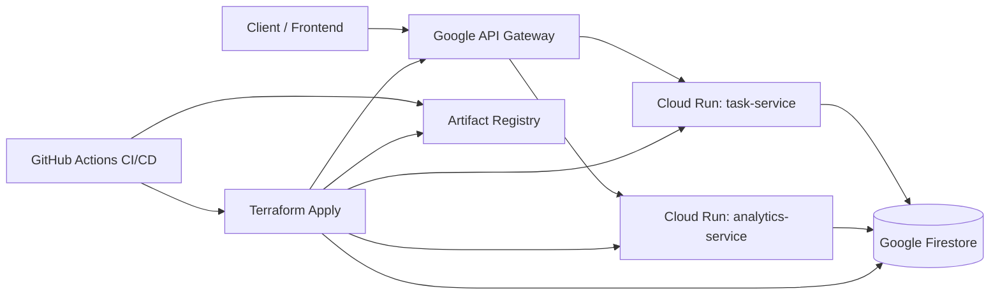

# SWE455 Technical Report  
**Project:** Smart Productivity Task Manager

## 1) System Overview

Smart Productivity Task Manager is a cloud-native backend composed of two functional microservices and one managed datastore:

- `task-service`: handles task CRUD, status updates, and completion tracking.
- `analytics-service`: provides read-only task analytics endpoints.
- `Firestore`: centralized persistent data storage.

The system is deployed on Google Cloud Run, fronted by Google API Gateway, and provisioned entirely through Terraform.

## 2) Architecture Diagram (Mermaid)

## 3) REST API Documentation

### API Gateway Routes

- `GET /health/task` -> task-service `/health`
- `GET /health/analytics` -> analytics-service `/health`
- `GET /tasks`, `POST /tasks`, `GET/PUT/PATCH/DELETE /tasks/{id...}` -> task-service `/api/tasks...`
- `GET /analytics/summary` -> analytics-service `/api/analytics/summary`
- `GET /analytics/overdue` -> analytics-service `/api/analytics/overdue`
- `GET /analytics/priority` -> analytics-service `/api/analytics/priority`
- `GET /analytics/completion-rate` -> analytics-service `/api/analytics/completion-rate`

### Task Service Core Endpoints

- `POST /api/tasks`
- `GET /api/tasks`
- `GET /api/tasks/:id`
- `PUT /api/tasks/:id`
- `DELETE /api/tasks/:id`
- `PATCH /api/tasks/:id/complete`

### Analytics Service Core Endpoints

- `GET /api/analytics/summary`
- `GET /api/analytics/overdue`
- `GET /api/analytics/priority`
- `GET /api/analytics/completion-rate`

## 4) CI/CD Explanation

The project uses GitHub Actions workflows triggered on push to `main`:

- `deploy.yml`

Pipeline flow:

1. Checkout source code.
2. Authenticate to Google Cloud with service account key.
3. Configure Docker auth for Artifact Registry.
4. Build and push service container image.
5. Execute `terraform apply` to deploy/update infrastructure.

This approach keeps deployments declarative and aligned with Infrastructure as Code principles.

## 5) GitHub Repository Links

- Main repository: `https://github.com/<your-org-or-user>/smart-productivity-task-manager`
- Task service source: `https://github.com/<your-org-or-user>/smart-productivity-task-manager/tree/main`
- Analytics service source: `https://github.com/<your-org-or-user>/smart-productivity-task-manager/tree/main/analytics-service`
- Infrastructure as Code: `https://github.com/<your-org-or-user>/smart-productivity-task-manager/tree/main/infrastructure`

## 6) Terraform Infrastructure Explanation

Terraform provisions all cloud resources:

- Required API enablement:
  - Cloud Run API
  - Firestore API
  - Artifact Registry API
  - API Gateway API
  - IAM API
  - Cloud Resource Manager API
- Artifact Registry Docker repository
- Firestore database in Native mode
- Cloud Run services:
  - `task-service`
  - `analytics-service`
- Public IAM invoker permissions for both services
- API Gateway:
  - API
  - API config (OpenAPI spec)
  - Gateway

No manual console provisioning is required for these managed components.

## 7) 15-Factor Methodology Mapping

| Factor Number | Factor Name | How Implemented | Evidence |
|---|---|---|---|
| 1 | One Codebase, One Application | All services and infrastructure live in one repository for one deployable system. | Root structure with `task-service`, `analytics-service`, `infrastructure`. |
| 2 | API First | Services communicate via documented REST APIs and API Gateway routes. | `routes/`, controllers, `infrastructure/openapi.yaml`. |
| 3 | Dependency Management | Dependencies are explicitly declared and isolated per service. | `package.json` files in root and `analytics-service/`. |
| 4 | Design, Build, Release, Run | CI workflow builds images, pushes to registry, and deploys via Terraform. | `.github/workflows/*.yml`. |
| 5 | Configuration, Credentials, Code | Environment-specific values are passed via env vars and Terraform vars. | `process.env.PORT`, `GOOGLE_CLOUD_PROJECT`, `variables.tf`. |
| 6 | Backing Services | Firestore is treated as an attached backing service, not embedded storage. | Firestore repositories in service layer. |
| 7 | Build, Release, Run Separation | Docker build stage and runtime deployment are separate pipeline phases. | Workflow steps: build/push then Terraform apply. |
| 8 | Stateless Processes | Services remain stateless and persist state only in Firestore. | No in-memory persistence; Firestore usage in repositories/services. |
| 9 | Disposability | Services support fast start and graceful SIGTERM/SIGINT shutdown. | Graceful shutdown handlers in both `index.js` files. |
| 10 | Dev/Prod Parity | Same containers and Terraform config are used across environments. | Docker + Terraform reused in CI and local workflows. |
| 11 | Logs | Services output structured or clear stdout/stderr logs for aggregation. | `analytics-service/utils/logger.js`, console logs in task-service. |
| 12 | Admin Processes | Operational tasks (deploy/destroy/smoke tests) are script-driven and repeatable. | `scripts/deploy.sh`, `scripts/destroy.sh`, `scripts/test-api.sh`. |
| 13 | Port Binding | Services self-host HTTP and bind to `PORT` env variable. | `process.env.PORT \|\| 8080` in both services. |
| 14 | Concurrency | Cloud Run scales stateless instances horizontally by request load. | Cloud Run managed runtime configuration in Terraform. |
| 15 | Telemetry | Health endpoints and structured logs support runtime observability. | `/health` endpoints, logger middleware usage. |

## 8) Demo Restoration Steps

1. Set environment variables (`GCP_PROJECT_ID`, `GCP_REGION`, `GAR_LOCATION`, `GAR_REPOSITORY`).
2. Run `./scripts/destroy.sh` to remove full cloud stack.
3. Run `./scripts/deploy.sh` to recreate full stack using code only.
4. Fetch `api_gateway_url` from Terraform outputs.
5. Run `API_BASE_URL=<gateway-url> ./scripts/test-api.sh`.

This demonstrates rapid environment teardown and restoration suitable for live demo.

## 9) AI Prompt Appendix

See `AI_PROMPTS_APPENDIX.md` for the prompt used to improve and harden this project for SWE455 requirements.
